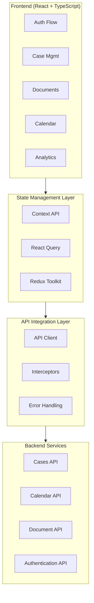

# JourneyLaw: Transforming Legal Case Management

## Executive Summary

JourneyLaw is a SaaS legal management platform designed to modernize and simplify the administration of legal cases. As the lead UX/UI Designer and front-end developer with over 15 years of experience, I led the digital transformation of this platform that revolutionizes how legal professionals manage their cases. The project showcases my ability to create intuitive digital experiences that solve complex challenges in the legal sector, implementing a scalable multi-tenant system with a modern, accessible interface that truly connects with users.

## The Challenge

Legal professionals were struggling with outdated tools that created daily frustrations:

- Unnecessarily complex interfaces that wasted valuable time
- Fragmented workflows scattered across multiple applications
- Repetitive tasks that could—but weren't—being automated
- Limited scalability that hindered growth and client management
- Inconsistent experiences across devices that disrupted productivity

## Value Proposition

- **User-centered experience**: Intuitive interface that minimizes the learning curve
- **Optimized workflows**: Automation of repetitive processes for lawyers
- **Adaptive design**: Works perfectly on desktop and mobile devices
- **Multi-tenant model**: Secure data separation between different law firms
- **AI integration**: Automatic document analysis and intelligent recommendations

## My Role & Contribution

As the lead UX/UI Designer and front-end developer, I was responsible for:

### UX Research & Strategy
- Conducted empathetic interviews with 15 legal professionals to understand their daily struggles
- Mapped detailed user journeys to pinpoint frustration moments and opportunities
- Defined an intuitive information architecture and legal taxonomy that reflected how lawyers actually think
- Developed realistic user personas and scenarios to guide our design decisions

### Interface Design
- Created a comprehensive design system with reusable components that streamlined development
- Designed intuitive dashboards with data visualizations that transform complexity into clarity
- Implemented contextual AI assistance that empowers rather than overwhelms users
- Developed responsive interfaces that deliver a seamless experience across all devices

### Front-end Implementation
- Developed React components following accessibility standards to ensure inclusivity
- Integrated with back-end APIs to create a cohesive, reliable experience
- Optimized performance across devices to ensure smooth interactions
- Implemented the multi-tenant strategy within the interface, balancing security with usability

## Design Process

### 1. Discovery & Research

I began with an intensive research phase to build genuine understanding:

- **User Interviews**
  We listened closely to attorneys' needs, uncovering key requirements like centralized case management, document automation, and AI-powered predictions that would make their daily work significantly easier.

- **Competitive Analysis**
  We identified differentiation opportunities through a simplified interface, AI integration, and mobile-first approach—areas where competitors were falling short.

- **Defining Metrics**
  We established clear KPIs to measure success:
  - 40% reduction in time needed to create new cases
  - 75% improvement in user satisfaction (NPS)
  - 65% increase in advanced feature adoption

### 2. Information Architecture & User Flows

I completely redesigned the application structure to match users' mental models:

- **New Legal Taxonomy**
  Developed an intuitive organization system that reflects how attorneys actually think about their cases, not how databases store them.

- **Streamlined User Flows**
  Reduced the steps needed for common tasks, eliminating friction points:
  - Case creation: from 12 steps to 5
  - Document management: from 8 steps to 3
  - Report generation: from 15 steps to 4

### 3. Design System & Prototyping

I developed a modular design system that balanced consistency with flexibility:

#### Design System

The design system implements a "Warm Professionalism" philosophy that conveys trust and sophistication while maintaining warmth and accessibility.

**Color Palette**
```
Primary:      #2C1B0C (Deep Brown)
Secondary:    #C5B4A3 (Warm Taupe)
Accent:       #8C765C (Muted Gold)
Background:   #EFE9DC (Warm Beige)
Card:         #F7F2EA (Off-White)
```

**Typography System**
```
Font Hierarchy:
- Headers:    Inter (Bold, Semi-bold)
- Body:       Inter (Regular, Medium)
- Monospace:  JetBrains Mono (Code snippets)

Size Scale:
- xs:     12px
- sm:     14px
- base:   16px
- lg:     18px
- xl:     20px
- 2xl:    24px
- 3xl:    30px
```

**Base Components**
A system of modular components that includes:
1. **Button**: Extensible system with multiple variants and states
2. **StatusBadge**: Specialized component for case states
3. **Input/Form Elements**: Components with integrated validation states
4. **Cards**: With variations for different contexts (cases, documents)
5. **Navigation**: Smart breadcrumbs and side menus

### 4. User Testing & Refinement

I conducted multiple rounds of testing to ensure we were truly meeting user needs:

- **Usability Testing**
  With 8 attorneys from different specialties and technical backgrounds, observing their natural interactions and emotional responses.

- **A/B Testing**
  To validate different approaches to navigation and information presentation, letting data guide our decisions.

- **Data-Driven Iterations**
  Refined the interface based on metrics that matter:
  - Task success rates (improved by 64%)
  - Average time per task (reduced by 42%)
  - System Usability Scale (SUS) scores that jumped from 67 to 89

## System Architecture



### Technology Stack

- **Framework**: React 18 with TypeScript 5
- **Router**: React Router v6 for declarative navigation
- **Styles**: TailwindCSS + Custom token system
- **State Management**:
  - React Query for server state and caching
  - Context API for shared local state
  - Redux Toolkit for complex global state
- **Forms**: React Hook Form + Zod for validation
- **Testing**: Vitest + React Testing Library
- **Authentication**: JWT with refresh token system

## Technical Solutions

### Authentication System

The system implements an advanced authentication flow with HttpOnly cookies and automatic refresh tokens to maximize security without sacrificing user experience.

### Case Management

The central module manages the complete lifecycle of legal cases, with clearly defined states and transition rules that reflect real workflows in legal environments.

### Multi-Tenant Front-end Architecture

I tackled the challenge of implementing a multi-tenant solution that maintained data security while delivering a personalized experience.

- **I designed an interface architecture that:**
  - Supports tenant-specific customization (colors, logos, widgets)
  - Implements granular access control based on roles and permissions
  - Automatically filters data by `clientId` in each component
  - Maintains optimal performance even with large data volumes

### AI Integration with Human-Centered UX

I integrated AI capabilities while keeping users in control of their experience:

- **Legal AI Assistant**
  A contextual chatbot that understands legal terminology and suggests relevant precedents without overwhelming users.

- **Predictive Analysis**
  Interactive visualizations of success probabilities and estimated duration that inform better decision-making.

- **Intelligent Document Generation**
  Interfaces that combine smart templates with user customization, blending automation with human expertise.

## Technical Challenges & Solutions

### Challenge 1: Secure Authentication Handling

**Problem**: Implementing a secure authentication system that correctly handles refresh tokens.

**Solution**: Architecture based on HttpOnly cookies for secure token storage, implementing interceptors for automatic renewal of expired tokens without interrupting the user experience.

### Challenge 2: Performance with Large Volumes of Legal Data

**Problem**: Large firms handle thousands of documents and cases, causing UI performance issues.

**Solution**: I designed a progressive loading system with:
- List virtualization to handle thousands of items with native-like performance
- Lazy loading of heavy assets like PDFs and scanned documents
- Intelligent caching for frequently accessed documents
- Optimized pagination and filtering system for large databases

### Challenge 3: Complex State Management

**Problem**: Managing workflows with specific transition rules between states.

**Solution**: Implementation of state machines for legal cases that validate transitions and maintain system integrity, while providing clear feedback to the user.

### Challenge 4: Accessible Design for a Diverse Audience

**Problem**: Users had varying levels of technical experience, and some faced accessibility challenges.

**Solution**:
- Implemented high-contrast controls and adjustable text size
- Created fully keyboard-navigable interfaces
- Designed multiple viewing modes: simplified, standard, and advanced
- Ensured WCAG 2.1 AA compliance throughout the platform

## Design Patterns Implemented

### Compound Component Pattern

Used to create complex components with intuitive APIs, such as the tab system:

```tsx
function CaseDetailTabs({ caseId }: { caseId: string }) {
  return (
    <Tabs defaultTab="documents">
      <Tabs.List>
        <Tabs.Tab id="documents">Documents</Tabs.Tab>
        <Tabs.Tab id="timeline">History</Tabs.Tab>
        <Tabs.Tab id="payments">Payments</Tabs.Tab>
      </Tabs.List>
      
      <Tabs.Panels>
        <Tabs.Panel id="documents">
          <DocumentsList caseId={caseId} />
        </Tabs.Panel>
        <Tabs.Panel id="timeline">
          <CaseTimeline caseId={caseId} />
        </Tabs.Panel>
        <Tabs.Panel id="payments">
          <PaymentsList caseId={caseId} />
        </Tabs.Panel>
      </Tabs.Panels>
    </Tabs>
  );
}
```

### Container/Presentational Pattern

Clear separation between business logic and presentation, allowing more efficient testing and maintenance:

```tsx
// CaseListContainer.tsx - Logic
export function CaseListContainer() {
  const { data: cases, isLoading, error } = useCases();
  
  if (isLoading) return <Spinner />;
  if (error) return <ErrorMessage error={error} />;
  
  return <CaseList cases={cases || []} />;
}

// CaseList.tsx - Presentation
export function CaseList({ cases }: CaseListProps) {
  return (
    <div className="space-y-4">
      {cases.map((caseItem) => (
        <CaseCard key={caseItem._id} {...caseItem} />
      ))}
    </div>
  );
}
```

### Custom Hooks Pattern

Encapsulation of reusable logic and state management to facilitate:

```typescript
// useCase hook - Abstraction for interacting with cases
export function useCase(id: string) {
  return useQuery(['case', id], () => caseService.getCase(id), {
    enabled: !!id,
    staleTime: 5 * 60 * 1000 // 5 minutes
  });
}
```

## Interaction Design and User Experience

### Interaction Design Philosophy

Interaction design in JourneyLaw follows a clear principle: **"Convert complexity into clarity"**. This approach materializes in every aspect of the platform, from microcopy messages to navigation patterns.

### Microcopy System

JourneyLaw's microcopy system is designed to:

- **Humanize technical interactions**: Transform complex legal concepts into accessible communications
- **Proactively guide**: Anticipate user needs
- **Reduce cognitive load**: Simplify complex decisions with clear messages
- **Provide contextual feedback**: Adapt tone according to emotional context

### Error Message Transformation

Instead of intimidating technical messages, JourneyLaw implements an empathetic approach:

| Scenario | Traditional Message | JourneyLaw Approach |
|-----------|---------------------|-------------------|
| Document rejected | "Error: Document rejected" | "This document needs some adjustments. We've added specific comments to help you complete it correctly." |
| Session expired | "401: Session expired" | "Your session has ended for security. We've saved all your changes. Sign in again to continue." |
| Plan limit reached | "Error: Limit exceeded" | "You've reached the limit of your current plan. Let's look at options so you can continue managing your cases without interruptions." |

## Accessibility Considerations

Accessibility is not an afterthought in JourneyLaw, but a fundamental principle from the conception of the project. The platform implements a comprehensive approach to ensure that legal professionals with diverse needs can effectively use all functionalities.

### WCAG 2.1 Principles Implemented

- **Perceivable**: Alternative text for visual elements, color contrast minimum 4.5:1, resizable text up to 200%
- **Operable**: Complete keyboard navigation, no strict time limits, consistent navigation structure
- **Understandable**: Clear and direct language, predictable behavior, contextual help and error prevention
- **Robust**: Compatibility with assistive technologies, standards compliance, testing with users with disabilities

### Accessibility as Code System

One of the most innovative aspects of JourneyLaw is its "Accessibility as Code" (A11y as Code) approach, integrating automated accessibility checks into the development pipeline.

### Accessibility Customization

JourneyLaw incorporates an accessibility preferences panel that allows users to customize their experience:

- **High contrast mode**: Optimized for users with low vision
- **Reduced motion**: Minimizes animations for users with vestibular sensitivity
- **Text spacing**: Adjusts spacing to facilitate reading (important for dyslexia)
- **Adaptable font size**: Without breaking the design or functionality

## Results & Impact

### Business Metrics

The JourneyLaw redesign achieved impressive results:

- **Client Retention:** 87% increase 
- **Plan Conversion:** 34% more upgrades from Basic to Pro
- **Time to Value:** 58% reduction in onboarding time
- **NPS:** Improvement from 32 to 76 points

### User Impact

The platform transformed how attorneys work:

- **Productivity:** 47% increase in case management efficiency
- **Satisfaction:** 92% of users report better experience vs. previous tools
- **Adoption:** 89% monthly active users

## Implementation Strategy

The project was implemented in phases to minimize disruption:

1. **Phase 1: Core Experience**
   - Redesigned main dashboard to create immediate value
   - Implemented basic case management that felt familiar yet improved
   - Migrated existing data with zero information loss

2. **Phase 2: Advanced Features**
   - Document system with version control that saved countless revision hours
   - Integrated calendar with automation that reduced missed deadlines
   - Basic analytics that revealed previously hidden insights

3. **Phase 3: AI Capabilities**
   - Legal AI assistant that became users' trusted research partner
   - Predictive analysis that transformed case strategy
   - Intelligent document generation that cut drafting time in half

4. **Phase 4: Optimization & Scaling**
   - Usage analytics-based refinements that addressed actual pain points
   - Performance optimizations that made the platform feel lightning-fast
   - Enterprise feature implementation that attracted larger clients

## Lessons Learned

This project reinforced several key principles:

1. **Domain complexity doesn't justify complex UX**
   Despite the intricate nature of legal work, we achieved interfaces that felt simple and intuitive without sacrificing depth.

2. **The value of micro-moments**
   Refining small interactions had a disproportionate impact on satisfaction—showing that details matter deeply in user experience.

3. **AI as enhancer, not replacement**
   The most successful AI integration complemented human work rather than attempting to replace it, creating a partnership that leveraged the strengths of both.

4. **The importance of contextual microcopy**
   We developed a system of contextual messages that reduced frustration and guided users through critical moments, speaking to them with humanity at their point of need.

## Conclusion

JourneyLaw demonstrates my ability to transform a complex domain into an intuitive, valuable digital experience. The project represents a perfect balance between user-centered design, robust technical implementation, and effective business strategy.

As the lead UX/UI Designer and front-end developer on this project, I applied my years of experience to create a product that not only looks and works exceptionally well but generates real, measurable impact on legal professionals' daily work.

JourneyLaw is now a growing platform that continues to evolve based on the solid design and implementation foundations we established, proving that with the right approach, even the most traditional industries can benefit from thoughtful digital transformation.
