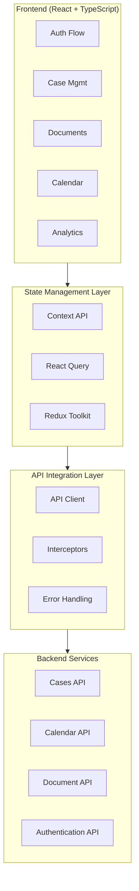

# JourneyLaw: Transformando la Gestión Legal

## Resumen Ejecutivo

JourneyLaw es una plataforma SaaS de gestión legal diseñada para modernizar y simplificar la administración de casos jurídicos. Como UX/UI Designer líder y desarrollador front-end con más de 15 años de experiencia, lideré la transformación digital de esta plataforma que revoluciona la forma en que los profesionales legales gestionan sus casos. El proyecto destaca mi capacidad para crear experiencias digitales intuitivas que resuelven desafíos complejos del sector legal, implementando un sistema multi-tenant escalable con una interfaz moderna y accesible que realmente conecta con los usuarios.

## El Desafío

Los profesionales legales enfrentaban numerosos desafíos con herramientas anticuadas:

- Interfaces innecesariamente complejas que desperdiciaban tiempo valioso
- Flujos de trabajo fragmentados entre múltiples aplicaciones
- Tareas repetitivas que podían —pero no estaban— siendo automatizadas
- Escalabilidad limitada que dificultaba el crecimiento y la gestión de clientes
- Experiencias inconsistentes entre dispositivos que interrumpían la productividad

## Propuesta de Valor

- **Experiencia centrada en el usuario**: Interfaz intuitiva que minimiza la curva de aprendizaje
- **Flujos de trabajo optimizados**: Automatización de procesos repetitivos para abogados
- **Diseño adaptativo**: Funciona perfectamente en escritorio y dispositivos móviles
- **Modelo multi-tenant**: Separación segura de datos entre diferentes despachos legales
- **Integración con IA**: Análisis automático de documentos y recomendaciones inteligentes

## Mi Rol y Contribución

Como UX/UI Designer líder y desarrollador front-end, fui responsable de:

### Investigación y Estrategia UX
- Conducción de entrevistas empáticas con 15 profesionales legales para entender sus dificultades diarias
- Mapeo de user journeys detallados para identificar momentos de frustración y oportunidades
- Definición de arquitectura de información intuitiva y taxonomía legal que reflejaba cómo piensan realmente los abogados
- Desarrollo de user personas y escenarios realistas para guiar nuestras decisiones de diseño

### Diseño de Interfaz
- Creación de un sistema de diseño completo con componentes reutilizables que agilizaron el desarrollo
- Diseño de dashboards intuitivos con visualización de datos que transforman la complejidad en claridad
- Implementación de asistencia IA contextual que empodera en lugar de abrumar a los usuarios
- Desarrollo de interfaces responsivas que ofrecen una experiencia fluida en todos los dispositivos

### Implementación Front-end
- Desarrollo de componentes React siguiendo estándares de accesibilidad para garantizar la inclusividad
- Integración con APIs de back-end para crear una experiencia cohesiva y confiable
- Optimización de rendimiento en todos los dispositivos para asegurar interacciones fluidas
- Implementación de estrategia multi-tenant en la interfaz, equilibrando seguridad con usabilidad

## Proceso de Diseño

### 1. Discovery e Investigación

Comencé con una fase intensiva de investigación para construir un entendimiento genuino:

- **Entrevistas con Usuarios**
  Escuchamos atentamente las necesidades de los abogados, descubriendo requisitos clave como gestión centralizada de casos, automatización de documentos y predicciones basadas en IA que facilitarían significativamente su trabajo diario.

- **Análisis Competitivo**
  Identificamos oportunidades de diferenciación a través de una interfaz simplificada, integración de IA y enfoque mobile-first—áreas donde los competidores estaban fallando.

- **Definición de Métricas**
  Establecimos KPIs claros para medir el éxito:
  - 40% de reducción en tiempo para crear nuevos casos
  - 75% de mejora en satisfacción del usuario (NPS)
  - 65% de aumento en adopción de características avanzadas

### 2. Arquitectura de Información y User Flows

Rediseñé completamente la estructura de la aplicación para coincidir con los modelos mentales de los usuarios:

- **Nueva Taxonomía Legal**
  Desarrollé un sistema de organización intuitivo que refleja cómo los abogados piensan realmente sobre sus casos, no cómo las bases de datos los almacenan.

- **User Flows Optimizados**
  Reduje los pasos necesarios para tareas comunes, eliminando puntos de fricción:
  - Creación de casos: de 12 pasos a 5
  - Gestión documental: de 8 pasos a 3
  - Generación de reportes: de 15 pasos a 4

### 3. Sistema de Diseño y Prototipos

Desarrollé un sistema de diseño modular que equilibraba consistencia con flexibilidad:

#### Sistema de Diseño

El sistema de diseño implementa una filosofía de "Profesionalismo Cálido" que transmite confianza y sofisticación mientras mantiene calidez y accesibilidad.

**Paleta de Colores**
```
Primary:      #2C1B0C (Marrón Profundo)
Secondary:    #C5B4A3 (Taupe Cálido)
Accent:       #8C765C (Dorado Apagado)
Background:   #EFE9DC (Beige Cálido)
Card:         #F7F2EA (Blanco Roto)
```

**Sistema Tipográfico**
```
Jerarquía de Fuentes:
- Headers:    Inter (Bold, Semi-bold)
- Body:       Inter (Regular, Medium)
- Monospace:  JetBrains Mono (Snippets de código)

Escala de Tamaños:
- xs:     12px
- sm:     14px
- base:   16px
- lg:     18px
- xl:     20px
- 2xl:    24px
- 3xl:    30px
```

**Componentes Base**
Un sistema de componentes modulares que incluye:
1. **Button**: Sistema extensible con múltiples variantes y estados
2. **StatusBadge**: Componente especializado para estados de casos
3. **Input/Form Elements**: Componentes con estados de validación integrados
4. **Cards**: Con variaciones para diferentes contextos (casos, documentos)
5. **Navigation**: Breadcrumbs inteligentes y menús laterales

### 4. Testing con Usuarios y Refinamiento

Realicé múltiples rondas de testing para asegurar que estábamos realmente satisfaciendo las necesidades de los usuarios:

- **Pruebas de Usabilidad**
  Con 8 abogados de diferentes especialidades y experiencia tecnológica, observando sus interacciones naturales y respuestas emocionales.

- **A/B Testing**
  Para validar diferentes enfoques de navegación y presentación de información, dejando que los datos guiaran nuestras decisiones.

- **Iteraciones Basadas en Datos**
  Refiné la interfaz basándome en métricas que importan:
  - Tasas de éxito en tareas (mejora del 64%)
  - Tiempo promedio por tarea (reducción del 42%)
  - Puntuaciones SUS (System Usability Scale) que aumentaron de 67 a 89

## Arquitectura del Sistema



### Stack Tecnológico

- **Framework**: React 18 con TypeScript 5
- **Router**: React Router v6 para navegación declarativa
- **Estilos**: TailwindCSS + Sistema de tokens personalizado
- **Gestión de Estado**:
  - React Query para estado del servidor y caché
  - Context API para estado local compartido
  - Redux Toolkit para estado global complejo
- **Formularios**: React Hook Form + Zod para validación
- **Testing**: Vitest + React Testing Library
- **Autenticación**: JWT con sistema de refresh token

## Soluciones Técnicas

### Sistema de Autenticación

El sistema implementa un flujo de autenticación avanzado con cookies HttpOnly y refresh tokens automáticos para maximizar la seguridad sin sacrificar la experiencia de usuario.

### Gestión de Casos

El módulo central gestiona el ciclo de vida completo de casos legales, con estados claramente definidos y reglas de transición que reflejan los flujos de trabajo reales en entornos jurídicos.

### Arquitectura Multi-Tenant en Front-end

Enfrenté el desafío de implementar una solución multi-tenant que mantuviera la seguridad de los datos mientras ofrecía una experiencia personalizada.

- **Diseñé una arquitectura de interfaz que:**
  - Soporta personalización por tenant (colores, logos, widgets)
  - Implementa control de acceso granular basado en roles y permisos
  - Filtra automáticamente datos por `clientId` en cada componente
  - Mantiene un rendimiento óptimo incluso con grandes volúmenes de datos

### Integración IA con UX Centrado en el Usuario

Integré capacidades de IA manteniendo al usuario en control de su experiencia:

- **Asistente Legal IA**
  Un chatbot contextual que entiende terminología legal y sugiere precedentes relevantes sin abrumar a los usuarios.

- **Análisis Predictivo**
  Visualizaciones interactivas de probabilidades de éxito y duración estimada que informan una mejor toma de decisiones.

- **Generación Documental Inteligente**
  Interfaces que combinan plantillas inteligentes con personalización del usuario, mezclando automatización con experiencia humana.

## Desafíos Técnicos y Soluciones

### Desafío 1: Manejo Seguro de Autenticación

**Problema**: Implementar un sistema de autenticación seguro que maneje correctamente los refresh tokens.

**Solución**: Arquitectura basada en cookies HttpOnly para almacenamiento seguro de tokens, implementando interceptores para renovación automática de tokens expirados sin interrumpir la experiencia del usuario.

### Desafío 2: Rendimiento con Grandes Volúmenes de Datos Legales

**Problema**: Las firmas grandes manejan miles de documentos y casos, causando problemas de rendimiento en la UI.

**Solución**: Diseñé un sistema de carga progresiva con:
- Virtualización de listas para manejar miles de elementos con rendimiento nativo
- Carga diferida de activos pesados como PDFs y documentos escaneados
- Caché inteligente para documentos frecuentemente accedidos
- Sistema de paginación y filtrado optimizado para bases de datos grandes

### Desafío 3: Gestión de Estados Complejos

**Problema**: Manejar flujos de trabajo con reglas de transición específicas entre estados.

**Solución**: Implementación de máquinas de estado para casos legales que validan transiciones y mantienen la integridad del sistema, mientras proporcionan feedback claro al usuario.

### Desafío 4: Diseño Accesible para un Público Diverso

**Problema**: Los usuarios tenían diferentes niveles de experiencia tecnológica, y algunos enfrentaban desafíos de accesibilidad.

**Solución**:
- Implementé controles de alto contraste y tamaño de texto ajustable
- Creé interfaces completamente navegables por teclado
- Diseñé múltiples modos de visualización: simplificado, estándar y avanzado
- Aseguré compatibilidad WCAG 2.1 AA en toda la plataforma

## Patrones de Diseño Implementados

### Compound Component Pattern

Utilizado para crear componentes complejos con APIs intuitivas, como el sistema de pestañas:

```tsx
function CaseDetailTabs({ caseId }: { caseId: string }) {
  return (
    <Tabs defaultTab="documents">
      <Tabs.List>
        <Tabs.Tab id="documents">Documentos</Tabs.Tab>
        <Tabs.Tab id="timeline">Historial</Tabs.Tab>
        <Tabs.Tab id="payments">Pagos</Tabs.Tab>
      </Tabs.List>
      
      <Tabs.Panels>
        <Tabs.Panel id="documents">
          <DocumentsList caseId={caseId} />
        </Tabs.Panel>
        <Tabs.Panel id="timeline">
          <CaseTimeline caseId={caseId} />
        </Tabs.Panel>
        <Tabs.Panel id="payments">
          <PaymentsList caseId={caseId} />
        </Tabs.Panel>
      </Tabs.Panels>
    </Tabs>
  );
}
```

### Container/Presentational Pattern

Separación clara entre lógica de negocio y presentación, permitiendo testing y mantenimiento más eficientes:

```tsx
// CaseListContainer.tsx - Lógica
export function CaseListContainer() {
  const { data: cases, isLoading, error } = useCases();
  
  if (isLoading) return <Spinner />;
  if (error) return <ErrorMessage error={error} />;
  
  return <CaseList cases={cases || []} />;
}

// CaseList.tsx - Presentación
export function CaseList({ cases }: CaseListProps) {
  return (
    <div className="space-y-4">
      {cases.map((caseItem) => (
        <CaseCard key={caseItem._id} {...caseItem} />
      ))}
    </div>
  );
}
```

### Custom Hooks Pattern

Encapsulación de lógica reutilizable y gestión de estado para facilitar:

```typescript
// useCase hook - Abstracción para interactuar con casos
export function useCase(id: string) {
  return useQuery(['case', id], () => caseService.getCase(id), {
    enabled: !!id,
    staleTime: 5 * 60 * 1000 // 5 minutos
  });
}
```

## Diseño de Interacción y Experiencia de Usuario

### Filosofía de Diseño de Interacción

El diseño de interacción en JourneyLaw sigue un principio claro: **"Convertir la complejidad en claridad"**. Este enfoque se materializa en cada aspecto de la plataforma, desde los mensajes microcopy hasta los patrones de navegación.

### Sistema de Microcopy

El sistema de microcopy de JourneyLaw está diseñado para:

- **Humanizar las interacciones técnicas**: Transformar conceptos legales complejos en comunicaciones accesibles
- **Guiar proactivamente**: Anticiparse a las necesidades del usuario
- **Reducir la carga cognitiva**: Simplificar decisiones complejas con mensajes claros
- **Proporcionar retroalimentación contextual**: Adaptar el tono según el contexto emocional

### Transformación de Mensajes de Error

En lugar de mensajes técnicos intimidantes, JourneyLaw implementa un enfoque empático:

| Escenario | Mensaje Tradicional | Enfoque JourneyLaw |
|-----------|---------------------|-------------------|
| Documento rechazado | "Error: Documento rechazado" | "Este documento necesita algunos ajustes. Hemos añadido comentarios específicos para ayudarte a completarlo correctamente." |
| Sesión expirada | "401: Sesión expirada" | "Tu sesión ha finalizado por seguridad. Te hemos guardado todos los cambios. Inicia sesión nuevamente para continuar." |
| Límite de plan alcanzado | "Error: Límite excedido" | "Has alcanzado el límite de tu plan actual. Veamos juntos las opciones para que puedas seguir gestionando tus casos sin interrupciones." |

## Consideraciones de Accesibilidad

La accesibilidad no es un añadido posterior en JourneyLaw, sino un principio fundamental desde la concepción del proyecto. La plataforma implementa un enfoque integral para garantizar que los profesionales legales con diversas necesidades puedan utilizar eficazmente todas las funcionalidades.

### Principios WCAG 2.1 Implementados

- **Perceptible**: Textos alternativos para elementos visuales, contraste de colores mínimo 4.5:1, texto redimensionable hasta 200%
- **Operable**: Navegación completa por teclado, sin límites de tiempo estrictos, estructura de navegación consistente
- **Comprensible**: Lenguaje claro y directo, comportamiento predecible, ayuda contextual y prevención de errores
- **Robusto**: Compatibilidad con tecnologías asistivas, cumplimiento de estándares, testing con usuarios con discapacidades

### Sistema de Accesibilidad como Código

Uno de los aspectos más innovadores de JourneyLaw es su enfoque de "Accesibilidad como Código" (A11y as Code), integrando comprobaciones de accesibilidad automatizadas en el pipeline de desarrollo.

### Personalización de Accesibilidad

JourneyLaw incorpora un panel de preferencias de accesibilidad que permite a los usuarios personalizar su experiencia:

- **Modo de alto contraste**: Optimizado para usuarios con baja visión
- **Reducción de movimiento**: Minimiza animaciones para usuarios con sensibilidad vestibular
- **Espaciado de texto**: Ajusta el espaciado para facilitar la lectura (importante para dislexia)
- **Tamaño de fuente adaptable**: Sin romper el diseño o la funcionalidad

## Resultados e Impacto

### Métricas de Negocio

El rediseño de JourneyLaw logró resultados impresionantes:

- **Retención de Clientes:** Aumento del 87% 
- **Conversión de Planes:** 34% más upgrades de Basic a Pro
- **Tiempo al Valor:** Reducción del 58% en tiempo de onboarding
- **NPS:** Mejora de 32 a 76 puntos

### Impacto en Usuarios

La plataforma transformó la manera en que los abogados trabajan:

- **Productividad:** Aumento del 47% en eficiencia de gestión de casos
- **Satisfacción:** 92% de usuarios reportan mejor experiencia vs. herramientas anteriores
- **Adopción:** 89% de usuarios activos mensuales

## Estrategia de Implementación

El proyecto fue implementado en fases para minimizar disrupciones:

1. **Fase 1: Experiencia Core**
   - Rediseño del dashboard principal para crear valor inmediato
   - Implementación de gestión básica de casos que resultaba familiar pero mejorada
   - Migración de datos existentes sin pérdida de información

2. **Fase 2: Funcionalidades Avanzadas**
   - Sistema de documentos con control de versiones que ahorró incontables horas de revisión
   - Calendario integrado con automatización que redujo plazos perdidos
   - Analytics básicos que revelaron insights previamente ocultos

3. **Fase 3: Capacidades IA**
   - Asistente legal IA que se convirtió en el compañero de investigación confiable de los usuarios
   - Análisis predictivo que transformó la estrategia de casos
   - Generación documental inteligente que redujo a la mitad el tiempo de redacción

4. **Fase 4: Optimización y Escalado**
   - Refinamientos basados en analytics de uso que abordaron puntos de dolor reales
   - Optimizaciones de rendimiento que hicieron que la plataforma se sintiera ultrarrápida
   - Implementación de características enterprise que atrajeron a clientes más grandes

## Lecciones Aprendidas

Este proyecto reforzó varios principios clave:

1. **La complejidad del dominio no justifica UX complejo**
   A pesar de la naturaleza intrincada del trabajo legal, logramos interfaces que se sentían simples e intuitivas sin sacrificar profundidad.

2. **El valor de los micro-momentos**
   El refinamiento de pequeñas interacciones tuvo un impacto desproporcionado en la satisfacción, mostrando que los detalles importan profundamente en la experiencia de usuario.

3. **IA como potenciador, no sustituto**
   La integración de IA más exitosa complementaba el trabajo humano en lugar de intentar reemplazarlo, creando una asociación que aprovechaba las fortalezas de ambos.

4. **La importancia del microcopy contextual**
   Desarrollamos un sistema de mensajes contextuales que reducía la frustración y guiaba a los usuarios a través de momentos críticos, hablándoles con humanidad en su punto de necesidad.

## Conclusión

JourneyLaw demuestra mi capacidad para transformar un dominio complejo en una experiencia digital intuitiva y valiosa. El proyecto representa un equilibrio perfecto entre diseño centrado en el usuario, implementación técnica robusta y estrategia de negocio efectiva.

Como UX/UI Designer líder y desarrollador front-end en este proyecto, apliqué mis años de experiencia para crear un producto que no solo se ve y funciona excepcionalmente bien, sino que genera un impacto real y medible en el trabajo diario de los profesionales legales.

JourneyLaw es ahora una plataforma en crecimiento que continúa evolucionando basada en los sólidos fundamentos de diseño e implementación que establecimos, demostrando que con el enfoque correcto, incluso las industrias más tradicionales pueden beneficiarse de una transformación digital bien pensada.
